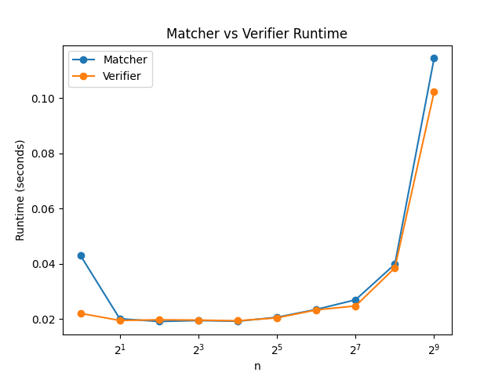

# Stable Matching Assignment

## Students

- **Adrian Pelaez** (UFID: `TODO`)
- **Arnav Bagmar** (UFID: `13716381`)

## Project Files

- **Matcher source:** [`src/matcher.py`](src/matcher.py)
- **Verifier source:** [`src/verifier.py`](src/verifier.py)
- **Example input:** [`data/example.in`](data/example.in)
- **Example output:** [`data/example.out`](data/example.out)

## Build / Compilation

No compilation required. The project is written in Python and runs directly with the interpreter.

**Dependencies:** Python 3.8+ and `matplotlib` (for graph plotting only).

```
pip install matplotlib
```

## How to Run

### Matcher

Reads preferences from stdin and writes the stable matching to stdout.

```bash
python3 src/matcher.py < data/example.in > data/example.out
```

### Verifier

Reads preferences **and** the matching result together from stdin. The input file and matcher output must be concatenated:

```bash
cat data/example.in data/example.out | python3 src/verifier.py
```

The verifier prints one of:
- `VALID STABLE` — the matching is valid and stable.
- `INVALID: <reason>` — the matching violates a validity constraint.
- `UNSTABLE: blocking pair (h, s)` — a blocking pair was found.

## Assumptions

- Input follows the specification: first line is `n`, followed by `n` hospital preference lists, then `n` student preference lists.
- All preference lists are complete permutations of `1..n`.
- The verifier expects the matching appended directly after the preference input (concatenated via stdin).
- Python 3.8+ is required. `matplotlib` is only needed for generating graphs.

## Task C — Runtime Analysis

### Graph



### How to Reproduce

1. **Generate test inputs** (sizes n = 1, 2, 4, …, 512):

   ```bash
   cd src
   python3 input_generator.py
   ```

   This populates `data/large_n/` with files `n1.in` through `n512.in`.

2. **Measure runtimes** for both matcher and verifier:

   ```bash
   cd src
   python3 measure_runtime.py
   ```

   This runs the matcher and verifier on each input, writing timing results to `data/results/matcher_times.txt` and `data/results/verifier_times.txt`.

3. **Plot the graphs:**

   ```bash
   cd src
   python3 plot_graphs.py
   ```

   This produces `graphs/combined_runtime.png` (and individual plots).

### Observed Trend

Both the matcher and verifier exhibit **O(n²)** runtime growth. Doubling `n` roughly quadruples the runtime, consistent with the theoretical complexity of Gale–Shapley.

The log-log plot confirms this: runtime increases slowly for small `n` and grows rapidly as `n` increases. The matcher and verifier curves are similar, with the matcher slightly slower due to more operations per proposal round.
